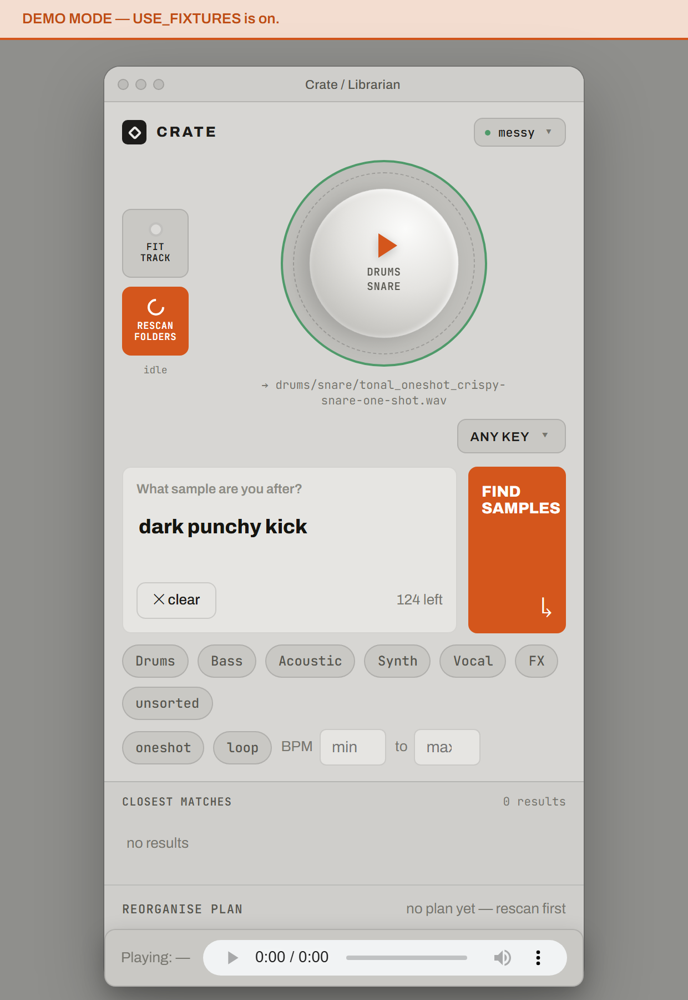
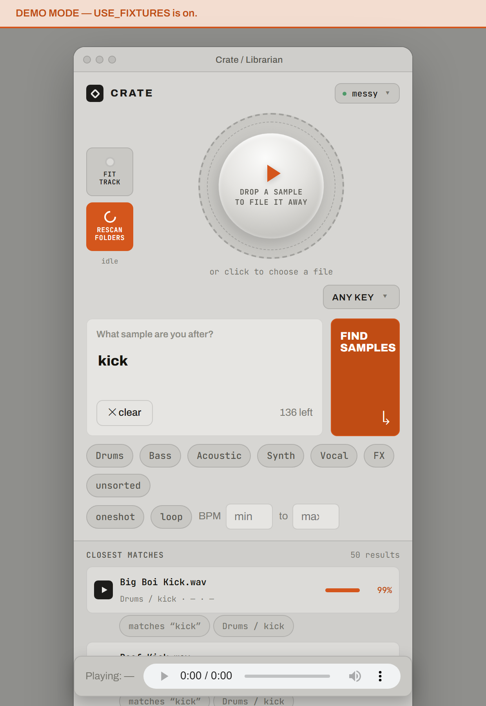
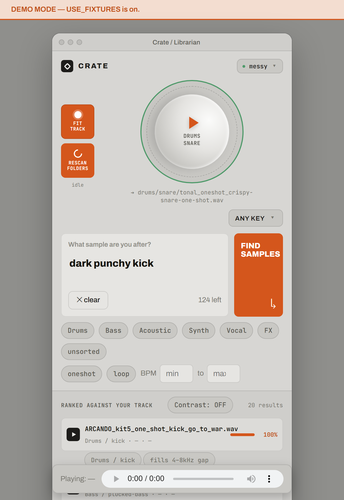
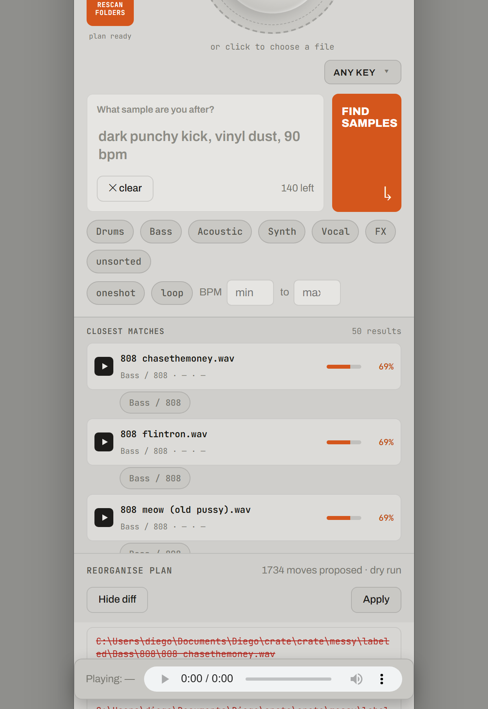

# crate

A little local tool for cleaning up a messy sample library. Point it at a folder full of badly-named WAVs dumped across a dozen subfolders, and it listens to every file, figures out what it is (kick, 808, vocal chop, whatever), and proposes a clean `family/instrument/...` layout for it — nothing moves until you say so, and every move can be undone.

It's four small Python files with one shared contract between them, plus a single HTML page for the UI. No build step, no framework, no database.

<p align="center">
  
</p>

## What each piece does

- **`analyzer.py`** — opens one audio file and turns it into a record: duration, peak level, BPM, key, loop-or-one-shot, a rough family/instrument guess, plus a few descriptor words like "dark" or "punchy". Real DSP via `librosa`, not guesswork — except the classification itself, which is filename-keyword based unless you've also installed `transformers`/`torch` for the CLAP model.
- **`index.py`** — an in-memory search index over those records. Fuzzy text search, family/type/BPM/key filters, and a "fit to this reference track" mode that ranks the whole library against a bounce you drop in.
- **`organiser.py`** — the part that's actually allowed to touch your files. It scans a folder, proposes a rename plan, and applies it. It never deletes anything, ever — a destination collision aborts the whole batch before a single file moves, and every apply writes an undo log first.
- **`api.py`** — stdlib-only HTTP server (`http.server`, no Flask) that wires the three above to the page below.
- **`static/index.html`** — the UI. One file, vanilla JS, no build tool.

## Running it

```
python -m venv .venv
.venv\Scripts\activate          # or source .venv/bin/activate on mac/linux
pip install -r requirements.txt
python api.py
```

Then open `http://127.0.0.1:8000/`. `api.py` itself needs nothing beyond the standard library — if you skip the `pip install`, the server still starts, it just serves demo fixtures instead of analysing real audio, and says so loudly in both the terminal and a banner at the top of the page.

## The interface

### Drop a sample, get it filed away

The circle in the middle is the whole point of the app in miniature: drop one audio file on it (or click to pick one), and it gets analysed, labelled, and moved straight into `family/instrument/...` under your library folder — for real, on disk. If the name isn't a confident match for anything, it lands in `_unsorted/` instead of a guess.

<p align="center">
  
</p>

### Search your library

Type what you're after — a word, an instrument, a vibe — and it ranks the library against it. Family, type (one-shot/loop), key and BPM filters sit right underneath if you want to narrow it down further. Clicking a result plays it through the bar at the bottom.

<p align="center">
  
</p>

### Fit a reference track

The **FIT TRACK** button in the left rail takes a bounce of whatever you're working on and re-ranks the whole library against it instead of a text query — useful for "what in here actually fits this song." **Contrast** flips it around and surfaces what stands *apart* from the track, for when you want something that cuts through instead of blending in.

<p align="center">
  
</p>

### Rescan and reorganise, safely

**RESCAN FOLDERS** walks your library folder and re-analyses everything in it, then builds a full reorganise plan automatically. Nothing happens to your files yet — **View diff** shows exactly what would move and why before you touch **Apply**, and **Undo** is one click for as long as the session lasts.

<p align="center">
  
</p>

## Why the labels are sometimes hardcoded

Real classification needs [CLAP](https://github.com/LAION-AI/CLAP) (`transformers` + `torch`), which is a heavy, slow install for a demo. Without it, `analyzer.py` falls back to matching keywords in the filename — which works, but only when the filename is honest about what it is. For the demo library shipped in `fixtures/records.json`, I ran that same keyword match separately over ~5,400 real samples, kept only the ~1,700 where the name was unambiguous (one match, no conflicts), and threw out anything that failed to decode. That's what `USE_FIXTURES` in `api.py` serves — real audio, filed correctly, without waiting on a multi-gigabyte model download. Flip it to `False` once CLAP is installed and it analyses live instead.

## Project layout

```
analyzer.py     A — one file in, one SampleRecord out
index.py        B — search over records
organiser.py    C — scan / plan / apply / undo (the dangerous one)
api.py          D — HTTP + the page
contracts.py    the shared shapes all four import
static/         the UI
make_fixtures.py   generates fixtures/records.json + a demo messy/ folder
```

`contracts.py` is the only file all four depend on — the `SampleRecord` shape, the family/instrument list, the search query. If you're changing what a record looks like, that's the one file everything else has to agree with.
